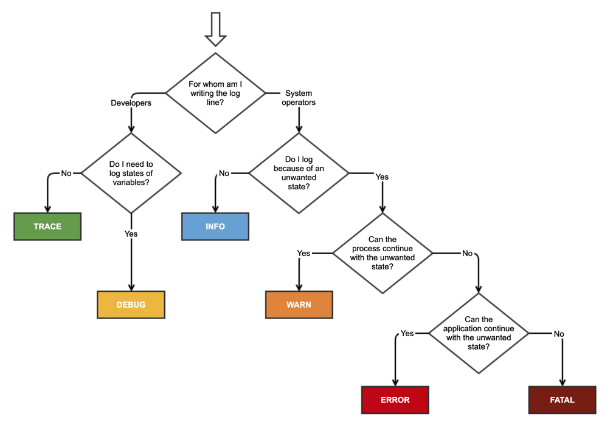

- [log](#Log)
    - [how it works](#how-it-works)
    - [usage](#usage)
- [Random](#Random)  
    - [how it works](#how-it-works-1)
    - [usage](#usage-1)
- [Timer](#Timer)
    - [how it works](#how-it-works-2)
    - [usage](#usage-2)
- [Pathfinding](#pathfinding)
    - [how it works](#how-it-works-3)
    - [usage](#usage-3)

# Log

### how it works


### usage


```c++
LOG_DEBUG("");
```
# Random

### how it works


### usage

# Timer

### how it works


### usage

# Pathfinding

### how it works

### usage
```c++
Utils::Pathfinding* instance = Utils::Pathfinding::get_instance();
glm::vec3 start = entity->get_pos(); //position vom entity
glm::vec3 end = instance->find_nearest(start,entity->get_priority()); //priority besagt auf was es geht
std::vector<glm::vec3> path = instance->find_path(end,start);
```
