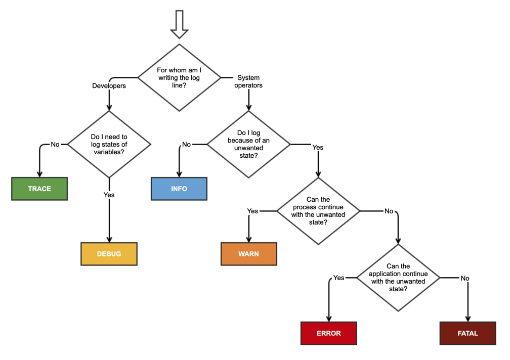

- [log](#Log)
    - [how it works](#how-it-works)
    - [usage](#usage)
- [Random](#Random)  
    - [how it works](#how-it-works-1)
    - [usage](#usage-1)
- [Timer](#Timer)
    - [how it works](#how-it-works-2)
    - [usage](#usage-2)
- [Pathfinding](#pathfinding)
    - [how it works](#how-it-works-3)
    - [usage](#usage-3)

# Log

## how it works


## usage


```c++
LOG_DEBUG("");

```
# Random

## how it works


## usage

# Timer

## how it works


## usage

# Pathfinding

## how it works
Immer wenn sich was an der Karte und/oder der Position des Sielers verändert hat wird der Dijkstra Algorithmus genutzt um vom Spieler und/oder Türmen aus Kosten und Pfad zu jeder Zelle auszurechnen, anschließend wird dann mittels Backtracking ein Pfad genneriert.


```c++
// Initialisierung eines Vektors, der alle Zellen enthaelt
// Eine PriorityQueue waere eigentlich besser, aber es gibt Probleme damit.
// Ein Vektor wird verwendet, und Sortierung fuehrt zum gleichen Ergebnis wie mit einer PriorityQueue.
std::vector<cell*> cells;
```
<!---
Hierzwischen sind noch ein par Checks um undefiniertes verhalten zu verhindern
--->

```c++
{// Setze die Distanz der Startpunkte auf 0 und deren Eltern auf nullptr
    size_t amount_valid = start_points.size();
	for (const auto start : start_points)
	{
	    if (!is_valid(start))
		{
		amount_valid--;
	    }
	    else
	    {
	        cellmap[start.z][start.y][start.x].dist = 0; // Distanz am Startpunkt auf 0 setzen
			cellmap[start.z][start.y][start.x].parent = nullptr; // Elternknoten auf nullptr setzen
	    }
	}
	if (amount_valid <= 0) //falls es keien gueltigen Start punkte gibt wird das pathfinden abgebrochen
	{
		LOG_ERROR("keine gueltigen start punkte verfuegbar");
	    return;
	}
}
```


```c++
while (!cells.empty())
{
    std::ranges::sort(cells, comp); // Sortiere den q_Vector nach Distanz absteigend.

    cell* current = cells.back(); // Nehme das letzte Element aus dem q_Vector.
    cells.pop_back(); // Loesche das letzte Element aus dem q_Vector.

    for (cell* neighbor : get_neighbors(current, cellmap)) // Hole die Nachbarn von current.
    {
		// Berechne die Distanz zwischen current und v.
		const double dist = current->dist + get_dist(current, neighbor);

		// Vergleiche die berechnete Distanz mit der in v gespeicherten Distanz.
		if (dist < neighbor->dist)
		{
	    	// Aktualisiere die Distanz und den Parent von v.
 	    	neighbor->dist = dist;
	    	neighbor->parent = current;
		}
    }
}
```


## usage
```c++
Utils::Pathfinding* instance = Utils::Pathfinding::get_instance();
instance->calculate_paths(); //wenn die pfade vorher noch nicht berechnet worden
glm::vec3 start = entity->get_pos(); //position vom entity
std::vector<glm::vec3> path = instance->find_path(start,entity->get_priority());
entity->set_path(path);
```

Bei mehreren entities macht man einmal calculate paths und ruft dann in einer schleife immer wieder die Funktion find_path auf.

```c++
Utils::Pathfinding* instance = Utils::Pathfinding::get_instance();
instance->calculate_paths(); //wenn die pfade vorher noch nicht berechnet worden
for(auto& entity : entities)
{
    glm::vec3 start = entity->get_pos(); //position vom entity
    std::vector<glm::vec3> path = instance->find_path(start, entity->get_priority());
    entity->set_path(path);
}

```
